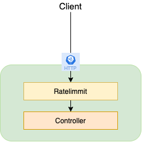

The example project for StringBoot service

<div align="center">
    
</div>

## Getting Started

## Project structure
```
.
├── service-A
│   ├── Dockerfile
│   ...
├── docker-compose.yaml
|
└── README.md
```

## Prerequisites
- Make sure that you have Docker and Docker Compose installed
  - Windows or macOS:
    [Install Docker Desktop](https://www.docker.com/get-started)
  - Linux: [Install Docker](https://www.docker.com/get-started) and then
    [Docker Compose](https://github.com/docker/compose)

## Start services
### Start services in local

- Build & start service-A
```shell script
$ cd service-A
$ ../mvnw clean package
$ ../mvnw spring-boot:run
...
```

### Start services in docker 

```shell script
$ docker-compose up -d
```

## Run testing

```shell script
curl http://localhost:8081/greet/1
```

## Stop project

- Kill project if start in local mode
- Stop infrastructure & services in docker

```shell script
$ docker-compose down
```

## Contribute

## Reference
- https://resilience4j.readme.io/docs/ratelimiter
- https://reflectoring.io/rate-limiting-with-springboot-resilience4j/